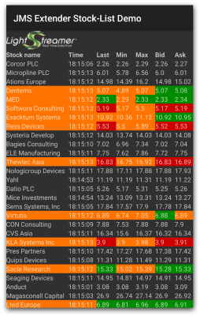

# Lightstreamer JMS Extender - Basic Stock-List Demo - Android Client

<!-- START DESCRIPTION lightstreamer-jms-example-stocklist-client-android -->

This project contains a full example of an Android application that shows how the [_Lightstreamer JMS Extender Java Client Library_](https://github.com/Lightstreamer/JMSExtender-lib-client-java) can be used to connect to Lightstreamer JMS Extender.  
The project is the Android version of the [Lightstreamer JMS Extender - Basic Stock-List Demo - Java SE Client](https://github.com/Lightstreamer/Lightstreamer-JMS-example-StockList-client-java).



## Details

This demo displays real-time market data for 30 stocks, generated by the feed simulator included in the [Lightstreamer JMS Extender - Stock-List Demo - Java (JMS) Service](https://github.com/Lightstreamer/Lightstreamer-JMS-example-StockList-service-java). For simplicity, only a subset of all available fields for each item is displayed. Moreover, a single JMS topic is used for all stocks, while in a real scenario you would probably use a different JMS topic for each stock.

Check out the sources for further explanations.
  
## Build

If you want to install a version of this demo pointing to your local Lightstreamer JMS Extender and running into 
an [Android Virtual Device](http://developer.android.com/tools/devices/emulator.html), follow these steps:

* Note that, as prerequisite, the [Lightstreamer JMS Extender - Stock-List Demo - Java (JMS) Service](https://github.com/Lightstreamer/Lightstreamer-JMS-example-StockList-service-java) has to be deployed on your local Lightstreamer JMS Extender instance. Please check out that project and follow the installation instructions provided with it.

* Launch Lightstreamer JMS Extender.

* You also need the _Android command line tools_:
  - [Download](https://developer.android.com/studio#command-tools) the tools package and extract it into `<your_android_sdk_root> cmdline-tools` folder,
 where `<your_android_sdk_root>` is a folder in your system.
  - Export the `ANDROID_SDK_ROOT` environment variable:
    ```sh
    $ export ANDROID_SDK_ROOT=<your_android_sdk_root>
    ```
  - From `<your_android_sdk_root>/cmdline-tools/tools/bin`, run the following command and accept all offered SDK package licenses:
    ```sh
    $ ./sdkmanager --licenses

* Create and start an Android Virtual Device:
  - Download the system image for the target virtual device:
     ```
     $ ./sdkmanager "system-images;android-29;default;x86"
     ```

  - Create the virtual device:
    ```
    $ ./avdmanager create avd -n jms_avd -d "pixel_xl" -k "system-images;android-29;default;x86" -d "pixel_xl"
    ```
  
  - From the `ANDROID_SDK_ROOT/emulator` folder, run the emulator
    ```
    $ ./emulator -avd jms_avd
    ```

  - From the project root, build and deploy the app to the emulator
    ```
    $ ./gradlew installDist
    ```

*Note that the demo targets the Lightstreamer server @ http://10.0.2.2:8080 because 10.0.2.2 is the special alias to your host loopback interface.*

### Start the Client

From the `ANDROID_SDK_ROOT/platform-tools`, launch the `StockListDemoActivity` by issuing  following command:
```
$ ./adb shell am start -n com.lightstreamer.jms.demo.stocklist_client/.StockListDemoActivity
```

## See Also

### Lightstreamer JMS Extender Service Needed by This Demo Client

<!-- START RELATED_ENTRIES -->
* [Lightstreamer JMS Extender - Stock-List Demo - Java (JMS) Service](https://github.com/Lightstreamer/Lightstreamer-JMS-example-StockList-service-java)

### Related Projects

* [Lightstreamer JMS Extender - Basic Stock-List Demo - Java SE Client](https://github.com/Lightstreamer/Lightstreamer-JMS-example-StockList-client-java)
* [Lightstreamer JMS Extender - Basic Stock-List Demo - HTML Client](https://github.com/Lightstreamer/Lightstreamer-JMS-example-StockList-client-javascript)
* [Lightstreamer JMS Extender - Basic Stock-List Demo - Node.js Client](https://github.com/Lightstreamer/Lightstreamer-JMS-example-StockList-client-node)

## Lightstreamer Compatibility Notes

* Compatible with Lightstreamer JMS Extender Java Client Library since version 2.0.0 or newer.
* Compatible with Lightstreamer JMS Extender since version 2.0.0 or newer.
